<div align="center">


<br><br>

<h3><code>thanvanth@github ~ $ ./contributions.sh</code></h3>


<br><br>

<h3><code>thanvanth@github ~ $ whoami</code></h3>
<table>
  <tr>
    <td valign="top"></td>
    <td valign="top"></td>
  </tr>
</table>

<br>

<h3><code>thanvanth@github ~ $ cat stack.toml</code></h3>


<br><br>

<h3><code>thanvanth@github ~ $ ./connect.sh</code></h3>
<a href="https://github.com/thanvanthat"></a>&nbsp;
<a href="https://instagram.com/thanvanth_ox"></a>&nbsp;
<a href="mailto:thanvanthat24@gmail.com"></a>

</div>

<br>

<details>
<summary><code>$ cat HOW_IT_WORKS.md</code></summary>

<br>

Everything above is a self-contained animated SVG (SMIL / CSS keyframes) — GitHub strips
`<script>` and inline styles from READMEs, but it plays animations inside SVGs loaded via ``.
No token, no third-party stats service.

| File | Made by | Refreshed |
| --- | --- | --- |
| `contrib-heatmap.svg` | `scripts/fetch_contributions.py` → `scripts/render_heatmap_svg.py` | daily, by `.github/workflows/update-profile-art.yml` |
| `ascii-portrait.svg` | `scripts/prep_photo.py` → `scripts/make_ascii_svg.py` | by hand, when the photo changes |
| `info-card.svg` | `scripts/make_info_card.py` | by hand, when details change |
| `headline.svg` | `scripts/make_headline.py` | by hand, when the lines change |
| `stack.svg`, `badges/*.svg` | `scripts/make_badges.py` (icons: Simple Icons, `scripts/icons.json`) | by hand, when the stack or links change |

Names, info-card rows, headline lines, stack and social links all live in `scripts/config.py`.

```bash
python -m venv .venv && source .venv/bin/activate

# heatmap (what the workflow runs)
pip install -r scripts/requirements.txt
python scripts/fetch_contributions.py && python scripts/render_heatmap_svg.py

# portrait from a photo (local only; without a photo the initials are drawn)
pip install -r scripts/requirements-portrait.txt
python scripts/prep_photo.py source-photo.jpg && python scripts/make_ascii_svg.py

# info card, headline, stack + connect badges
python scripts/make_info_card.py && python scripts/make_headline.py && python scripts/make_badges.py
```

`STATIC=1` on any generator emits a frozen frame for previews.

</details>
